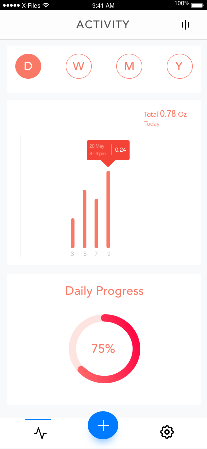
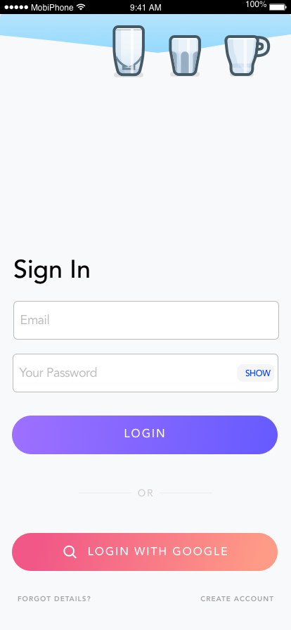
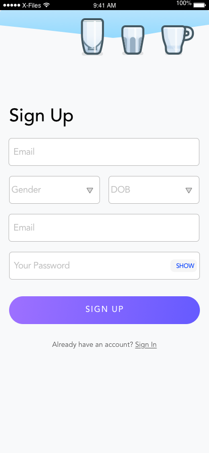
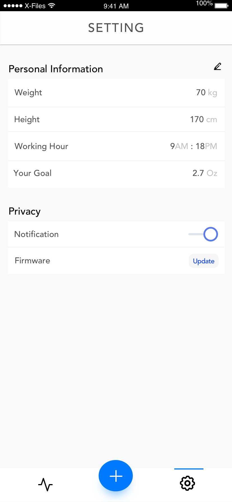

# smartdock-mobile

Understand your bodies. Let's reduce dehydration in office worker.

### Show some :heart: and star the repo to support the project

### Download

Comming soon on both Android and iOS

### Screenshots

#### Main screens

   

#### Setup screens

   

#### Profile screens

   

### Created & Maintained By

[Trong Dinh](https://github.com/trongdth) ([@trongdth](https://www.twitter.com/trongdth))

> If you found this project helpful or you learned something from the source code and want to thank me, consider buying me a cup of :coffee:
>
> * [Ethereum address: 0x9a1592C20A15f99AbB6b69E199f38D50Fa8372Ac]
> * [EOS account: zcryptoman1z]

## Getting Started

- For help getting started with Flutter, view [online documentation](https://flutter.dev/docs), which offers tutorials, 
samples, guidance on mobile development, and a full API reference.
